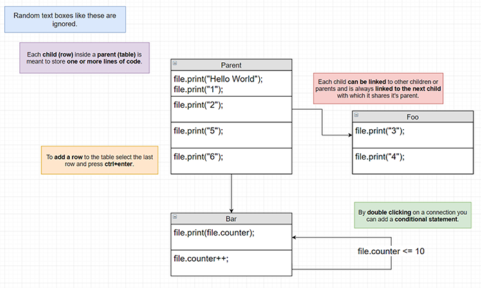
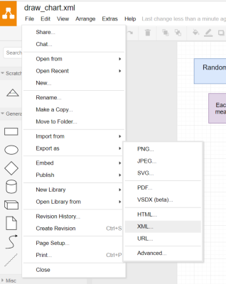
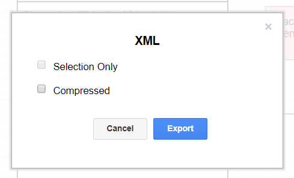

# flower
NPM module for improved logic flow. Create and visualize complex decision trees with ease.
=======
# Flower
NPM module for improved logic flow. _Create and visualize complex decision trees with ease._

* [Installation](#Installation)
* [Documentation](#Documentation)
* [Project Structure](#Project Structure)


##Installation
It's recommended to install the NPM package globally. By doing so NPM will automatically add the command to PATH.
```
npm install -g flower.js
```

_

To verify the installation run:
```
flower test
```
Expected output:
```
> Successful installation
```

## Documentation

Flower allows you to compile a flowchart to a javascript file.
The generated file can then be accessed by other scripts in your project which in turn, must pass any methods or variables you call from in the flowchart.

* ### Editor
    Currently the only supported editor is *[draw.io](https://www.draw.io/), a popular open source flowchart editor.
    
    *_a specially designed fork of which, will come soon._

* ### Example  

    This is an example of a program. You can find at [/demo](https://github.com/PadLex/flower/tree/master/demo)
    
    >! 
    
    The example project comes with a file named "foo.js". This script is responsible with calling functions from the compiled chart and
     passing available parameters.
     
     ```
     //Import chart
     const bar = require('./bar');
     
     //Variables used in chart
     available_parameters = {
         counter: 7,
     
         print: function(arg1) {
             console.log('print: %s', arg1);
         }
     };
     
     //Call first function and pass parameters used by the flowchart.
     bar.Parent(available_parameters);
     ```
     
     

* ### Exporting
    To export a flowchart select 'File/Export as/XML'
    
    >! 
    
    Export as uncompressed XML.
    
    ***_If this isn't an option please make sure you only have one page in the document._**
    
    >! 
    
    
* ### Compiling 
    After having installed the library and saved your flowchart in the appropriate folder you can compile it into
     java script with the following command:
     
     ```
     flower compile -s demo/draw_chart.xml -d demo/bar.js
     ```
     
     Where `-s` is the **source** xml file and `-d` the **destination** for the compiled js file.
    
    
    
    


## ToDo: \<Project Structure\>

If you intend to contribute to the project this guide will aid you in understanding the project structure and TODO's
